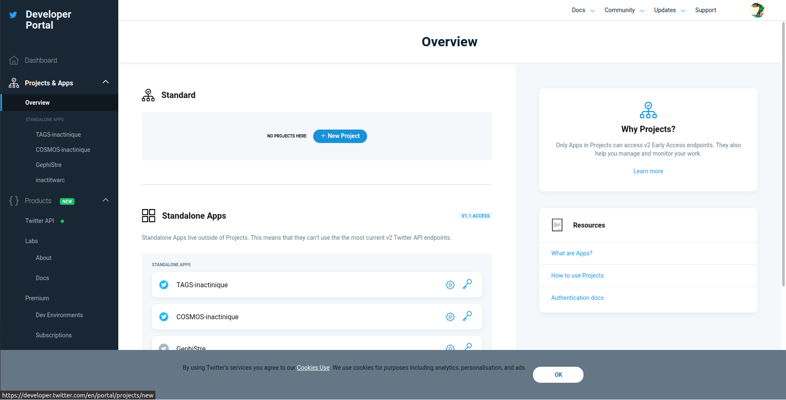
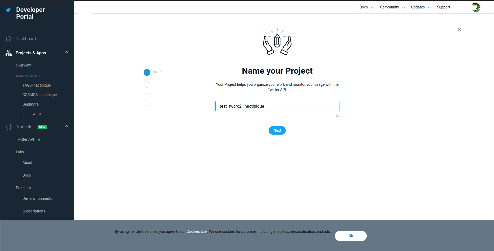
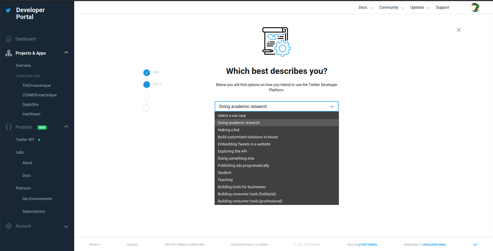
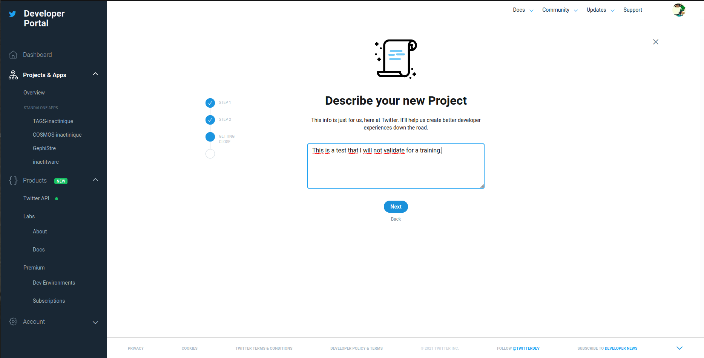
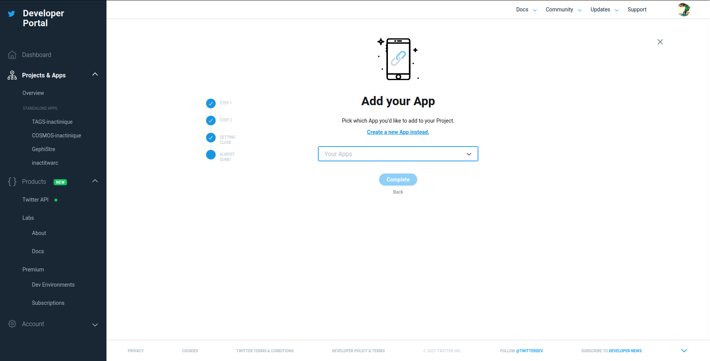
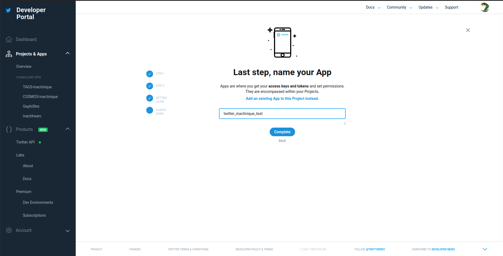
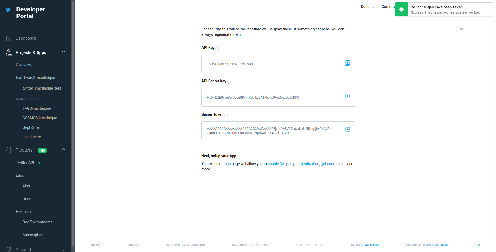

# Créer une application sur Twitter

À partir de maintenant, nous considérons que vous avez un compte développeur "académique" de Twitter.

[<<< Retour](03InstallationTwarc.md) | [Suivant >>>](05PremiereRequeteAvecTwarc.md)
